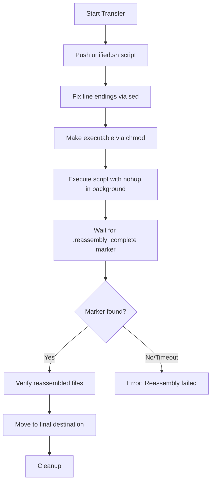

# ADB Transfer Tool Refactor - Implementation Plan

## Overview

This document outlines a major refactor of the ADB Transfer Tool focusing on three key areas:

1. **Transfer Folder Factorization** - Create a copy folder `a_for_transfer` for transfer operations
2. **ADB-Only Transfer Fix** - Debug and fix the ADB shell mode transfer that currently doesn't work
3. **Logger Scroll Fix** - Prevent auto-scroll when user is reading previous logs

---

## 1. Transfer Folder Factorization

### Problem

When transferring folder `a`, users want to create a sibling copy `a_for_transfer` at the same level to create a factorized/optimized folder for transfer (likely with chunked files or modified structure).

### Proposed Changes

#### [NEW] `src/utils/folder_manager.py`

Create a new utility module for folder management:

```python
class TransferFolderManager:
    def create_transfer_folder(self, source_folder: Path) -> Path:
        """
        Creates a copy of source_folder named 'foldername_for_transfer'
        at the same level as the source folder.
        """

    def delete_transfer_folder(self, source_folder: Path) -> bool:
        """
        Deletes the corresponding _for_transfer folder if it exists.
        """

    def get_transfer_folder_path(self, source_folder: Path) -> Path:
        """
        Returns the path of the _for_transfer folder.
        """
```

#### [MODIFY] `src/main.py`

Add UI elements and integration:

1. Add two new buttons in the action buttons frame:

   - "Créer Dossier Transfer" - Creates `source_for_transfer` folder
   - "Supprimer Dossier Transfer" - Deletes the `_for_transfer` folder

2. Add a checkbox option in settings:

   - "Utiliser dossier de transfert factorisé" - When enabled, automatically uses `_for_transfer` folder for transfers

3. Update `start_transfer_thread()` to use `_for_transfer` folder when option is enabled

---

## 2. ADB-Only Transfer Investigation & Fix

### Problem

Transfer doesn't work when done solely with ADB (without Termux). The `reassemble_via_adb_shell()` method in `reassembly.py` is used when `use_adb_shell_mode = True` (the default), but it's not functioning correctly.

### Current Flow Analysis



### Potential Issues to Investigate

1. **Script Execution**: The `nohup sh ./unified.sh` may not execute properly in ADB shell

   - Check if `sh` is available vs `bash`
   - Verify script paths are correct

2. **Marker File Detection**: The `.reassembly_complete` marker file may not be created

   - Check if unified.sh creates this file on success
   - Verify path matching

3. **Move Operation**: The `_move_to_final_destination()` may fail silently

### Proposed Investigation Steps

#### [MODIFY] `src/core/reassembly.py`

1. Add verbose logging to `reassemble_via_adb_shell()`:

   ```python
   # Log command that will be executed
   self.logger.info(f"[{self.device_id}] [DEBUG] Command: {cmd}")

   # Log script content verification
   result = self.adb.run_command(f'shell "cat {remote_temp_dir}/unified.sh | head -5"', self.device_id)
   self.logger.info(f"[{self.device_id}] [DEBUG] Script head: {result}")
   ```

2. Verify script output by capturing logs:

   ```python
   # Instead of redirecting to /dev/null, log to a file
   cmd = f"cd {remote_temp_dir} && nohup sh ./unified.sh {remote_temp_dir} > /sdcard/reassembly.log 2>&1 &"
   ```

3. Check for script execution errors:
   ```python
   # After waiting, check the log file
   result = self.adb.run_command(f'shell "cat /sdcard/reassembly.log"', self.device_id)
   self.logger.info(f"[{self.device_id}] [DEBUG] Reassembly log: {result}")
   ```

#### [VIEW] `src/utils/unified.sh`

Need to examine the shell script to ensure:

- It creates `.reassembly_complete` marker on success
- It handles all edge cases
- It works with `sh` (not just `bash`)

---

## 3. Logger Scroll Fix

### Problem

When new log messages arrive, the log widget always scrolls to the bottom via `self.progress_text.see(tk.END)`. This prevents users from reading previous logs while a transfer is in progress.

### Root Cause

In `main.py` line 1833-1835:

```python
def log(self, message, tag="info"):
    self.progress_text.insert(tk.END, str(message) + "\n", tag)
    self.progress_text.see(tk.END)  # Always scrolls to bottom
```

### Proposed Fix

#### [MODIFY] `src/main.py`

Replace the `log()` method with a smart-scroll version:

```python
def log(self, message, tag="info"):
    # Check if user is currently at the bottom
    # If they've scrolled up, don't auto-scroll

    # Get current scroll position
    visible_end = self.progress_text.yview()[1]
    at_bottom = visible_end >= 0.99  # Consider "at bottom" if within 1%

    # Insert new message
    self.progress_text.insert(tk.END, str(message) + "\n", tag)

    # Only scroll if user was already at bottom
    if at_bottom:
        self.progress_text.see(tk.END)
```

This approach:

- Checks if the user's view is at the bottom before inserting
- Only auto-scrolls if they were already at bottom
- Preserves scroll position when user is reading previous logs

---

## Verification Plan

### 1. Logger Scroll Fix (Manual Test)

**Steps:**

1. Run the application: `python src/main.py`
2. Connect a device and start a transfer to generate many log messages
3. While logs are being generated, scroll up in the log area
4. Observe: The view should stay where you scrolled (not jump to bottom)
5. Scroll to the bottom manually
6. Observe: New logs should now auto-scroll as they come in

**Expected:** User can read historical logs without being interrupted by new messages.

### 2. Transfer Folder Feature (Manual Test)

**Steps:**

1. Run the application: `python src/main.py`
2. Select a source folder containing files (e.g., `C:\test_folder`)
3. Click "Créer Dossier Transfer" button
4. Observe: A new folder `C:\test_folder_for_transfer` should be created with the same contents
5. Click "Supprimer Dossier Transfer" button
6. Observe: The `_for_transfer` folder should be deleted

### 3. ADB-Only Transfer (Manual Test)

**Steps:**

1. Enable "Mode sans Termux" in Settings (should be enabled by default)
2. Connect a real Android device via USB
3. Select a source folder and target directory
4. Start transfer and observe logs
5. Check device for reassembled files in target directory

---

## Implementation Order

1. **Logger Scroll Fix** (Quick win, low risk)
2. **ADB-Only Transfer Investigation** (Requires debugging, may need multiple iterations)
3. **Transfer Folder Feature** (New feature, can be done independently)

---

## User Review Required

> [!IMPORTANT]
> Please clarify the following before implementation:

1. **Transfer Folder Copy**: Should `_for_transfer` folder contain:

   - An exact copy of the source folder?
   - Or just the chunked/prepared files for transfer?

2. **ADB Investigation**: Do you have any specific error messages or logs from when the ADB-only transfer fails?

3. **Priority**: Which of the three items should be prioritized first?
